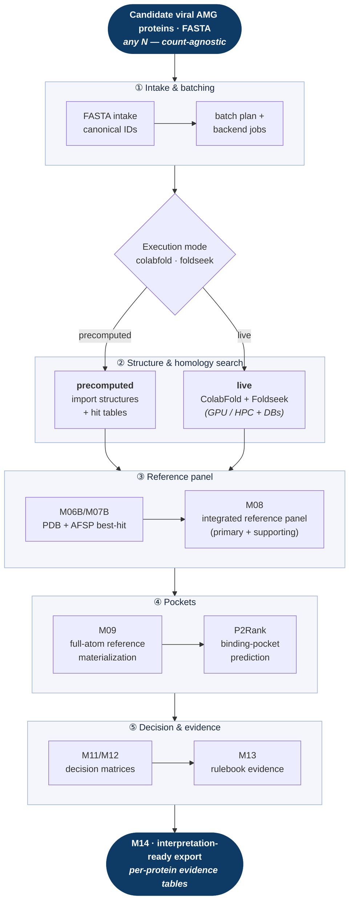

# VermAMG

**A reproducible structural–functional validation pipeline for viral auxiliary metabolic genes (AMGs).**


> _From raw FASTA to evidence-backed functional hypotheses — structure-aware,
> contract-checked, and reproducible at any scale._

> Status: active development. The precomputed downstream (structure import →
> reference panel → pocket prediction → decision export) is stable and
> reproducible. Live structure prediction via ColabFold and additional evidence
> axes are being extended. See [Roadmap](#roadmap).

VermAMG takes a set of candidate viral AMG protein sequences and runs them
through a guarded, resumable pipeline that predicts/imports structures, finds
structural homologs, builds a curated reference panel, detects binding pockets,
and produces interpretation-ready decision tables — turning raw FASTA into
structured, evidence-backed functional hypotheses.

The pipeline is **data-agnostic**: it processes whatever protein set you give it
(tens to hundreds of thousands of sequences) without any hardcoded size limit.

---

## What it does



> Both modes converge on the **same contract-checked downstream** — nothing after
> the homology search knows or cares whether structures were predicted live or
> imported. Each box is a numbered **stage** with a recorded checkpoint, so runs
> are fully **resumable** and isolated under one per-project run directory.

> 🖼️ **Static, high-resolution renders** of this architecture diagram (poster /
> slide quality) live in [`docs/assets/`](docs/assets/):
> [PNG](docs/assets/pipeline_architecture.png) ·
> [SVG (vector)](docs/assets/pipeline_architecture.svg). A detailed stage-by-stage
> **pipeline map** (M00 → M15) is also rendered there
> ([PNG](docs/assets/pipeline_map.png) · [SVG](docs/assets/pipeline_map.svg)),
> alongside the written [docs/PIPELINE_MAP.md](docs/PIPELINE_MAP.md).

<details>
<summary>Plain-text version</summary>

```
FASTA ─▶ ColabFold ─▶ Foldseek ─▶ best-hit ─▶ reference ─▶ P2Rank ─▶ decision ─▶ export
        (structure)   (PDB+AFSP    selection    panel       (pockets)  matrices
                       homologs)
```

</details>

### Two execution modes (same downstream, same contracts)

| Mode | ColabFold / Foldseek | Needs | Use when |
|------|----------------------|-------|----------|
| **precomputed** | imports existing structures + hit tables | no GPU/DBs | you already have structures, or for the bundled smoke demo |
| **live** | runs ColabFold + Foldseek for real | GPU (or HPC) + DBs | starting from FASTA only |

Switch with two config keys (`colabfold.mode`, `foldseek.mode`);
everything downstream is identical.

---

## Quickstart — smoke demo (5 min, no databases required)

The repo ships a 3-protein precomputed demo that exercises the **full pipeline
end-to-end** (FASTA intake → structure import → reference panel → P2Rank pockets
→ decision matrices → interpretation export) without downloading any databases.

```bash
# 1. Clone and install Python dependencies
git clone <repo-url> VermAMG && cd VermAMG
python3 -m pip install -r requirements.txt

# 2. Install P2Rank + Java (needed for pocket prediction)
bash setup.sh --tools-only

# 3. Run the demo
python scripts/vermamg.py run \
    --config examples/smoke_precomputed/config.yaml \
    --resume --follow
```

Outputs land in `runs/smoke_precomputed/smoke_3prot_v1/exports/`.

> **Linux/WSL note:** Foldseek, P2Rank, and container-based rendering must run
> from a Linux environment. On Windows, open WSL and:
> `cd /path/to/VermAMG && bash setup.sh --tools-only`

---

## Full usage (your own project — 3 steps)

**Step 1 — Install tools and databases**

```bash
bash setup.sh          # Foldseek binary + P2Rank + Foldseek PDB/AFSP DBs
```

See [docs/INSTALL.md](docs/INSTALL.md) for details and the ColabFold MSA DB
(needed only for live structure prediction).

**Step 2 — Configure your project**

```bash
# Local workstation / WSL:
cp run_templates/local_run.yaml.template run_configs/my_project.yaml

# HPC / SLURM cluster:
cp run_templates/hpc_slurm_run_v2.yaml.template run_configs/my_project.yaml
```

Open the file and fill in every `[FILL]` field: project name, FASTA path,
precomputed input paths or live-mode settings, and tool paths printed by
`setup.sh`. Documented field-by-field in
[run_templates/README_RUN_TEMPLATES.md](run_templates/README_RUN_TEMPLATES.md).

**Step 3 — Plan, then run**

```bash
python scripts/vermamg.py plan --config run_configs/my_project.yaml   # validate first
python scripts/vermamg.py run  --config run_configs/my_project.yaml --resume --follow
```

Final interpretation tables land in `runs/{project}/{run}/exports/`.

---

## Architecture

VermAMG v2 is organized around a **project-scoped run**. Describe the project,
inputs, environment, and options once in a YAML config; the orchestrator plans,
validates, runs, resumes, and exports under one isolated directory:

```text
runs/{project}/{run}/
  metadata/   inputs/   state/   logs/
  work/        # machine-generated intermediate artifacts
  results/     # scientific tables and decision layers
  exports/     # user-facing final package
```

A single guarded launcher drives everything:

```bash
python scripts/vermamg.py plan      --config run_configs/my_project.yaml   # validate + preview
python scripts/vermamg.py run       --config run_configs/my_project.yaml --resume --follow
python scripts/vermamg.py status    --config run_configs/my_project.yaml
python scripts/vermamg.py stage-info --stage 080_m09c_materialize_references
```

---

## Repository layout

```text
scripts/
  vermamg.py          # guarded orchestrator CLI (plan / run / status / stage-info)
  vermamg_lib/        # core: config, run_context, stage_registry, executor, state
  modules/            # stage implementations (intake, adapters, structural, decision, export)
config/               # environment defaults and resource manifest
run_templates/        # fill-in-the-blanks templates (local + HPC)
run_configs/          # example run configurations
examples/             # bundled smoke demo (precomputed, DB-free)
pipeline_contracts/   # stage I/O contracts
pipeline_data/        # curated rulebook knowledge base
docs/                 # architecture, stage contracts, pipeline map, install guide
resources/            # tools, databases, containers  (NOT in git — setup.sh installs these)
inputs/   runs/       # your FASTA inputs / per-project run outputs (NOT in git)
```

---

## Local vs HPC

The same config model serves both, selected by `environment.backend`:

- `local` — runs tools directly on your machine (GPU recommended for live mode).
- `slurm` — emits/submits one SLURM job per batch on an HPC cluster.

Use the dedicated template for each; field differences are documented in
[run_templates/README_RUN_TEMPLATES.md](run_templates/README_RUN_TEMPLATES.md).

---

## Documentation

- [docs/INSTALL.md](docs/INSTALL.md) — tool/database install, disk requirements
- [docs/ARCHITECTURE_V2_PROJECT_RUNS.md](docs/ARCHITECTURE_V2_PROJECT_RUNS.md) — design and run model
- [docs/STAGE_INPUT_CONTRACTS.md](docs/STAGE_INPUT_CONTRACTS.md) — per-stage I/O contracts
- [docs/PIPELINE_MAP.md](docs/PIPELINE_MAP.md) — stage map
- [docs/RESOURCE_MANIFEST_GUIDE.md](docs/RESOURCE_MANIFEST_GUIDE.md) — tools/DB resource layout
- [docs/DEV_NOTES.md](docs/DEV_NOTES.md) — development notes and run checkpoints
- [docs/assets/](docs/assets/) — rendered diagrams (architecture + pipeline map) as high-resolution PNG and vector SVG

---

## Roadmap

- [x] Project-scoped v2 run model with guarded, resumable orchestrator
- [x] Precomputed downstream (structure homology → reference panel → pockets → decisions → export)
- [x] FASTA intake, batching, and backend job planning (local + SLURM)
- [x] Live ColabFold + Foldseek adapters wired into the same contracts
- [x] Bundled 3-protein smoke demo (`examples/smoke_precomputed/`) — verified clone → run → M14 export, no DBs
- [ ] Topology (DeepTMHMM) and catalytic (M-CSA / UniProt) evidence axes
- [ ] Packaging (`pip install`, `vermamg` console command)

---

## Notes on interpretation

- The primary/rank-1 structural decision is preserved; supporting references are
  audit/context evidence and never silently override it.
- P2Rank pockets are computational top-1 predictions, not experimental
  active-site validation.

---

## License

See [LICENSE](LICENSE). This is unpublished research software shared for
evaluation and collaboration; please contact the author before redistribution
or reuse.

## Contact

**Yazgan Uğur**
PhD candidate, Basic and Industrial Microbiology
Department of Biology, Faculty of Science, Istanbul University

- **Email (preferred for contact):** [yazgan.ugur@ogr.iu.edu.tr](mailto:yazgan.ugur@ogr.iu.edu.tr)
- GitHub: [@Yazganugur](https://github.com/Yazganugur)
- LinkedIn: [yazgan-uğur](https://www.linkedin.com/in/yazgan-u%C4%9Fur-b75797202/)
- ORCID: [0009-0005-7907-9480](https://orcid.org/0009-0005-7907-9480)

Open to collaboration in structural bioinformatics and viral metagenomics.
Please get in touch by email for questions, collaboration, or licensing.
